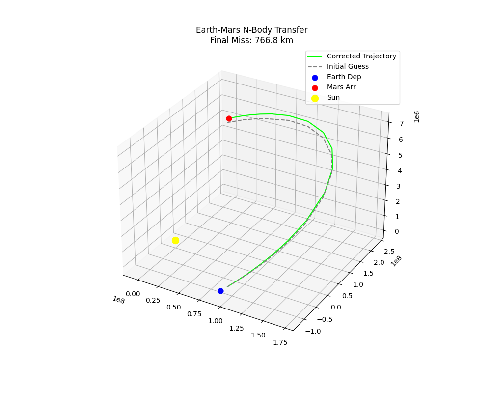
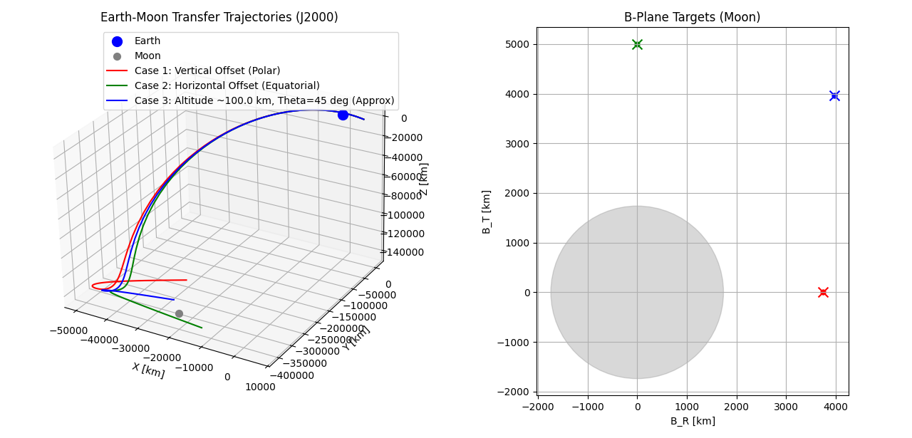
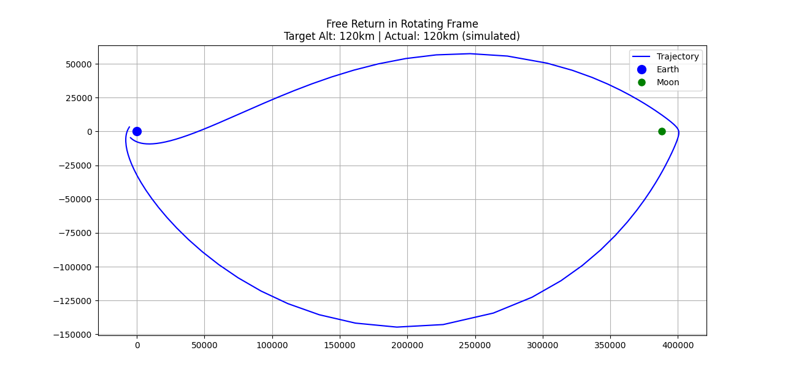
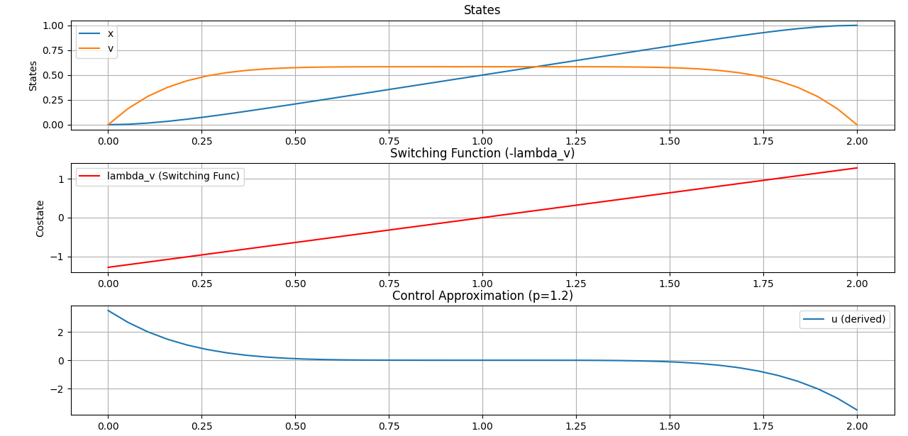
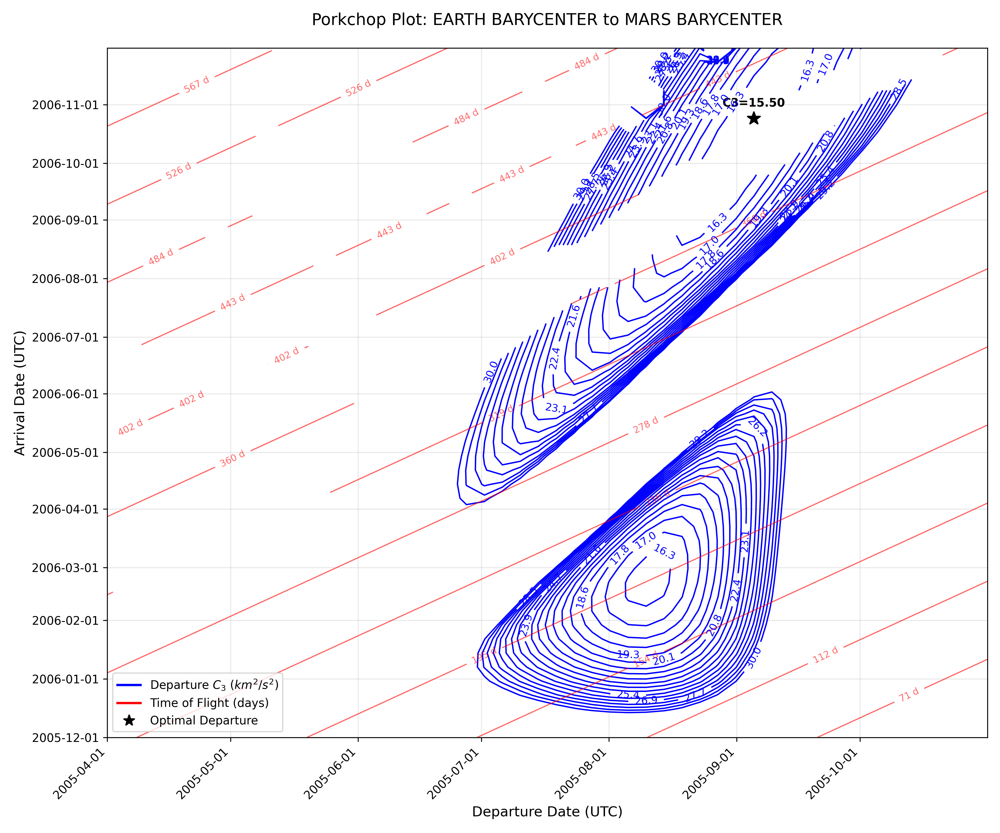
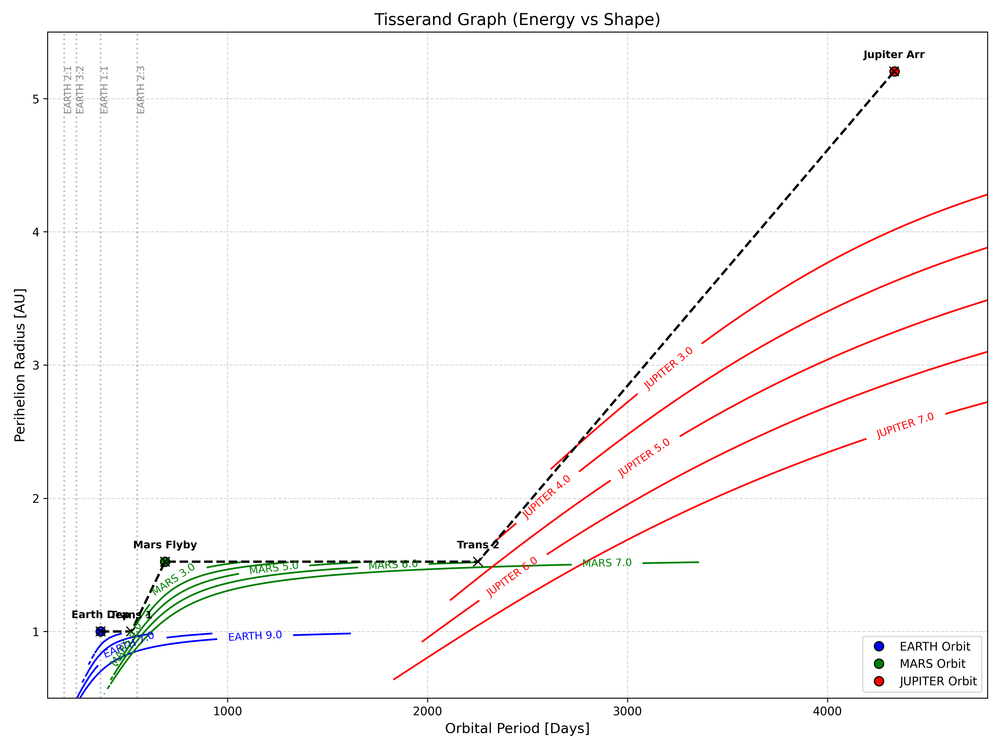
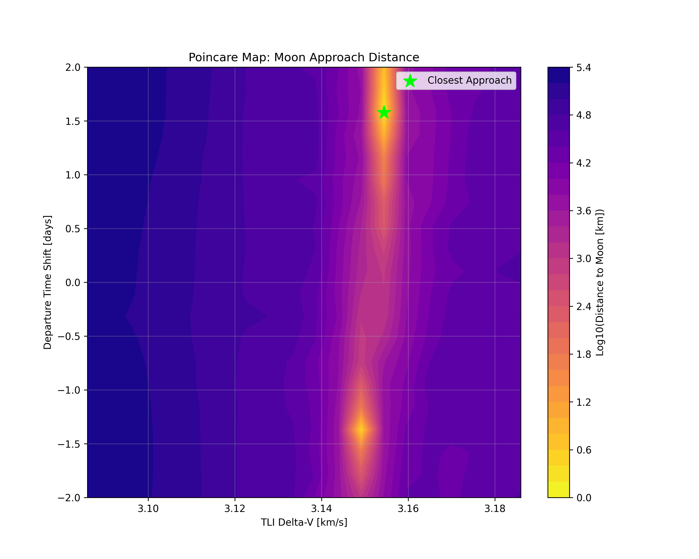

# 🌌 Deep Space Mission Design Toolkit

[](https://opensource.org/licenses/MIT)
[](https://www.python.org/downloads/)

A high-fidelity Python toolkit for interplanetary trajectory analysis, optimization, and mission design. This repository provides advanced tools ranging from N-body propagation to symbolic optimal control solvers and global launch window scans.

---

## 🚀 Key Features

### 🔭 High-Fidelity Dynamics
-   **N-Body Propagator**: Full numerical integration using SPICE ephemeris data (Sun, Planets, Moon).
-   **Perturbations**: Realistic force models including Solar Radiation Pressure (SRP), Atmospheric Drag, and J2 Zonal Harmonics.
    -   *Note: J2 gravity requires SPICE kernels with specific body constants (e.g., `J2E` for Earth).*
-   **Variational Equations**: Automatic State Transition Matrix (STM) propagation for navigation and optimization.

### 🛠️ Mission Design & Targeting
-   **B-Plane Targeting**: Precise targeting of gravity assist flyby parameters (B·R, B·T).
-   **Lambert Solver**: Robust solution of the two-body boundary value problem (Gauss method).
-   **Porkchop Plotter**: Global launch window analysis identifying C3 energy and Time-of-Flight (TOF) optima.
-   **Tisserand Analysis**: Visualizing gravity assist opportunities and energy changes between bodies.

### 📊 Advanced Optimization
This toolkit provides multiple pathways for solving trajectory optimization problems:
-   **Symbolic Indirect Methods**: Transform Optimal Control Problems (OCP) into TPBVPs via Pontryagin's Minimum Principle with automated symbolic derivation.
-   **Numerical Shooting Methods**:
    *   **Single Shooting**: Fast convergence for well-behaved boundary value problems.
    *   **Multiple Shooting**: Robust solving of sensitive trajectories by breaking them into segments (purely numerical implementation).
-   **Direct Collocation**: Solving OCPs via Hermite-Simpson discretization of the state and control paths.
-   **Smoothing Homotopy**: Robustly transitioning from Minimum Energy to Minimum Fuel problems using continuation methods.

---

## 🛠️ Installation & Setup

### 1. Clone & Install
```bash
git clone https://github.com/BatuhanAkkova/deep-space-mission-design-toolkit.git
cd deep-space-mission-design-toolkit
pip install -e .
```

### 2. SPICE Kernels
This toolkit requires SPICE kernels. Place your `.bsp`, `.tpc`, and `.tls` files in the `data/` directory. 
Recommended kernels:
- `de440.bsp` (Planetary Ephemeris)
- `naif0012.tls` (Leaperseconds)
- `pck00010.tpc` (Planetary Constants)

---

## 📐 Mission Design Conventions

All calculations follow strict astrodynamics standards:
-   **Time System**: Barycentric Dynamical Time (TDB) / Ephemeris Time (ET).
-   **Coordinate Frames**: `ECLIPJ2000` (Ecliptic) for interplanetary, `J2000` (Equatorial) for near-Earth.
-   **Units**: SI-based with **Kilometers (km)** and **km/s** as standard for SPICE compatibility.
-   **Assumptions**: Patched-conic results are routinely validated against full N-body numerical integration.

---

## 🔭 Examples

The [examples/](examples/) directory contains demonstration scripts. Key highlights:

### Trajectory Propagation & Targeting
| Analysis | Visualization |
| :--- | :--- |
| **N-Body Correction**<br>Lambert seed followed by high-fidelity differential correction. |  |
| **B-Plane Targeting**<br>Precisely hitting polar/equatorial aiming points at the Moon. |  |
| **Free Return (Fig-8)**<br>Earth-Moon-Earth trajectory optimized for reentry. |  |

### Optimization & Planning
| Method | Visualization |
| :--- | :--- |
| **Indirect Optimization**<br>Solving Optimal Control Problems (OCP) using Pontryagin's Minimum Principle. |  |
| **Homotopy (Smoothing)**<br>Transitioning from Minimum Energy to Minimum Fuel problems. |  |

### Mission Planning Tools
| Tool | Visualization |
| :--- | :--- |
| **Porkchop Plotter**<br>Global scan of launch windows identifying optimal C3 and TOF opportunities. |  |
| **Tisserand Analysis**<br>Visualizing gravity assist opportunities and energy changes. |  |
| **Poincare Map**<br>Analyzing stability and approach regions for complex trajectories (e.g., Earth-Moon). |  |

---

## 🗺️ Roadmap

-   [ ] **Navigation & GNC**: Orbit Determination (EKF, Batch Least Squares), Covariance Analysis.
-   [ ] **Multiple Flybys**: Generalized MGA (Multiple Gravity Assist) solver.
-   [ ] **Low Thrust**: Continuous low-thrust trajectory optimization.
-   [ ] **Invariant Manifolds**: Transfers using stable/unstable manifolds (CR3BP).

---

## 📄 License

MIT License. See [LICENSE](LICENSE) for details.

## Author

**Batuhan Akkova**
[Email](mailto:batuhanakkova1@gmail.com)
